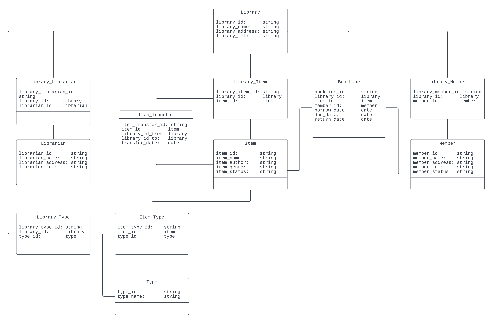

**Capstone Project Planning**

**Library UML**

**Business Rules**

* A library should be able to lend items to members.
* A library should have librarians that manage operations.
* A library should have multiple types of items. E.g. Books, DVDs, Newspapers etc..
* A library should be able to swap books between other locations.
* A library should track the status of an item.
* Members should be able to return items to a library.

**Data Entities**

* **Library - **The main entity. It houses the books and items that members are allowed to borrow. There can be multiple libraries.
  * library_id
  * library_name
  * library_address
  * library_tel
* **Librarian - **Staff of the library that manage the operations. Librarians can work at multiple libraries.
  * librarian_id
  * librarian_name
  * librarian_address
  * librarian_tel
* **Item -** Items, like books and newspapers, that belong to a library. These items can be borrowed and returned by members. Each item has a unique string identifier.
  * item_id
  * item_name
  * item_author
  * item_genre
  * item_status
* **Member - **People that have a membership to the library, allowing them to borrow and return items. Members can be registered to multiple libraries.
  * member_id
  * member_name
  * member_address
  * member_tel
  * member_status
* **Type - **An entity that accounts for the different types an item can be. E.g. Books, newspapers, DVDs, articles etc.
  * type_id
  * type_name

**Transaction Entities**

* **Bookline - **The purpose of Bookline is to track the transactions between the library and members. It will track the borrow date, the due date and the actual return date.
  * bookline_id
  * library_id
  * item_id
  * member_id
  * borrow_date
  * due_date
  * return_date
* **Item_Transfer -  **The purpose of Item Transfer is to track when books are swapped between libraries. It tracks the date and the IDs of the relevant libraries.

**Relational Entities**

* **Library_Librarian - **The relationship between library and librarian. One librarian can work at multiple libraries.
* **Library_Item - **The relationship between library and item. One belongs to one library, as each item is unique.
* **Library_Member -**
* **Library_Type -**
* **Item_Type -**

**Item Identification**

The identification is based on the Dewey Decimal System, with each item having a unique identifier based on its classification.

E.g. 820-XXX-XXX-XXX-XXX
